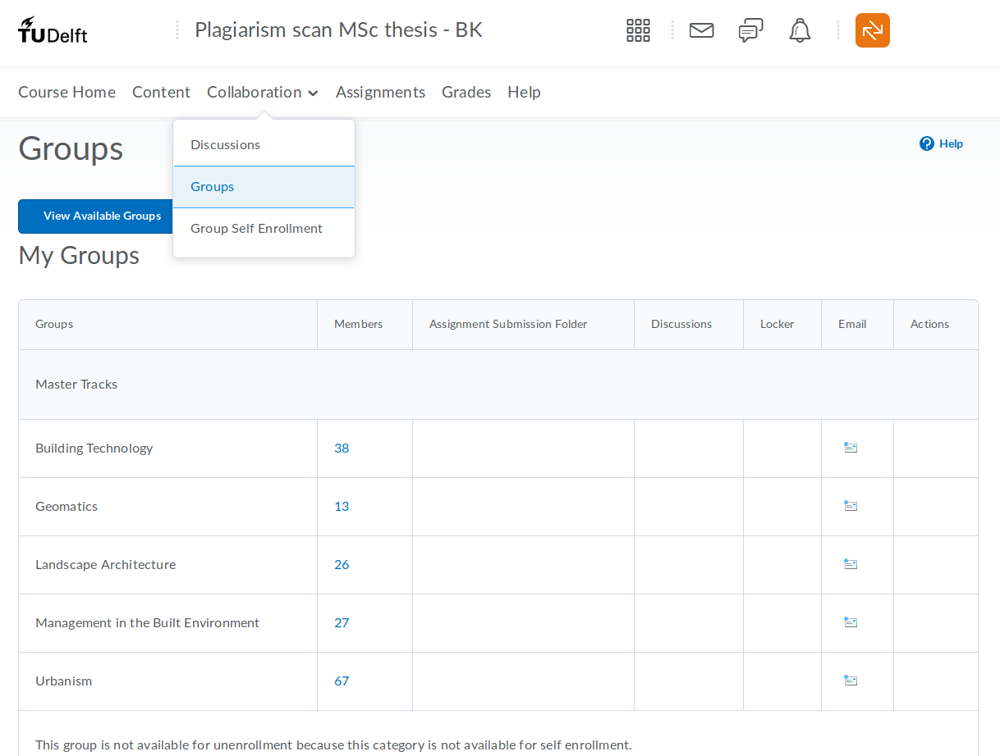

One week before P4, students need to upload their draft to the [Brightspace Plagiarism Scan page](https://brightspace.tudelft.nl/d2l/home/47493) so that their supervisors can assess whether it's original work or not. 

Steps: 

1. [enrol for the course](https://brightspace-cc.tudelft.nl/), the name is 'Plagiarism scan MSc thesis - BK'.
2. enroll under 'Collaboration' into the group of 'Geomatics', before the provisional and definitive check turn up (as they are Assignments based on group membership in Brightspace).

[Full details from BK administration are here](Nieuw_Teacher_mail_V4.docx). 

