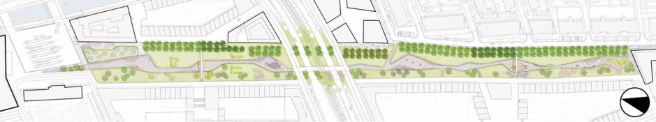
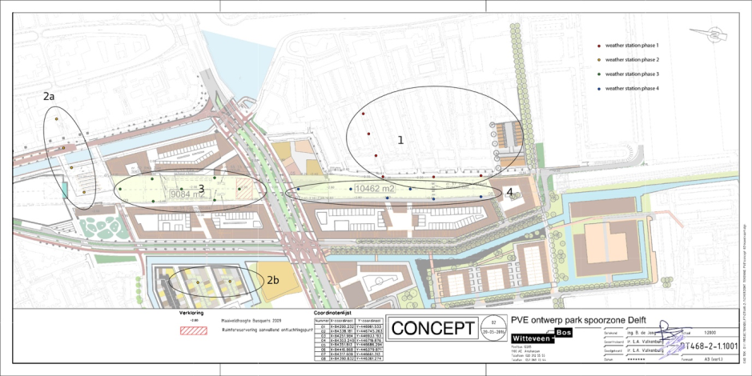

- - -

* Table of Content
{:toc}

#### 3D Pedestrian Flow Modelling

The structure of indoor space affects the movement of pedestrians by obstructing direct movement, making certain moves possible and certain moves more difficult or longer. The aggregate result of such effects shapes the movement patterns of pedestrians in indoor spaces. These patterns eventually affect functional efficiency, safety, and security of buildings; the importance of which is obvious in public complex buildings such as hospitals, transportation hubs and educational buildings. To model pedestrian movement flows, path-finding algorithms need to be developed to include cognitive factors in the path-finding methods. Based on such paths, pedestrian flows and probabilistic models of movement can be devised to be used in assessing functional efficiency, safety and security. Spatial data models used for such models are often challenging for automatic processing for both technical and methodical reasons. The core activity of this research would be to bring together two families of pedestrian movement simulation models by means of matching their underlying spatial data models (network and continuum space representations. The work will be specifically about developing spatial data models and algorithms.

*Contact:* [Pirouz Nourian](mailto:P.Nourian@tudelft.nl)

- - -

#### The Van Leeuwenhoekpark Delft – Sensing, Monitoring, Modelling and Adapting the Urban Micro Climate

On top of the roof of Delft’s new train tunnel a new city park will be realized: the Van Leeuwenhoekpark. The park – about 600 meters long and 40 meters wide, in the centre of the city – is to be innovative, smart and sustainable.
One of the main requirements for the park is that it will be climate resistant; minimizing heat stress and preventing water problems – in the park itself, but also in its surroundings. To help meet this requirement, a team of researchers from our Faculty was commissioned to advise the selected landscape architect, model the microclimate and its components, and monitor the microclimate before, during and after realization of the park with a network of weather stations. Furthermore interactive information of visitors and citizens of delft is planned.

The climate monitoring serves multiple purpose:

  - measuring the performance of the park,
  - providing data for the validation of climate simulations and
  - providing feedback for possible alterations and maintenance when the park is realized, as well as
  - informing the visitors of the park about the climate conditions;

Possible thesis topics
Within this project there are a variety of thesis projects are possible like:

  - (a) development and installation of a network of low cost and low maintenance weather stations, including data transmitting, storing and validation;
  - (b) Developing a framework to validate and improve existing micro climate simulations;
  - (c) Developing a methodology of the analyses, interpretation and online representation of urban climate data to inform citizen and decision makers.

There is material budget available for thesis under letter a; We are also checking the possibility for (paid) internships in relation with topic a.

Background information

In order to gauge the performance of the park, the current microclimate in the (direct) vicinity of the park needs to be measured.  This year’s thesis project should focus the locations 1 and 2a (Fig 2.).

The weather stations should measure:

  - air temperature
  - solar radiation
  - wind speed
  - wind direction
  - relative humidity
 
We are encouraging collaborative graduation projects where  different students work together, by separating the tasks, for example along the different sensors.

For further questions please contact: [Alexander Wandl](mailto:a.wandl@tudelft.nl)
 or [Marjolein Pijpers-van Esch](mailto:M.M.E.Pijpers-vanEsch@tudelft.nl)

- - -

#### Waste as a Resource - Urban Metabolism

The department of Urbanism was recently granted the Horizon 2020 research Project REPAiR – Resource Management in Peri-urban Areas: Going Beyond Urban Metabolism- We attempt to connect our research closer to our teaching activities, therefore students who follow a thesis project in relation to REPAiR will have the chance to work together with a team of researchers from several European countries and may take part in international workshops. The research is also related to the AMS.

A shift towards a more circular economy is crucial in order to achieve more sustainable and inclusive growth. The core objective of REPAiR is to provide local and regional authorities with an innovative transdisciplinary open source geodesign decision support environment (GDSE) developed and implemented in living labs in six metropolitan areas. The GDSE allows creating integrated, place-based eco-innovative spatial development strategies aiming at a quantitative reduction of waste flows in the strategic interface of peri-urban areas. These strategies will promote the use of waste as a resource, thus support the on-going initiatives of the European Commission towards establishing a strong circular economy. The identification of such eco-innovative strategies will be based as much as possible on the integration of life cycle thinking and geodesign in order to operationalise urban metabolism (UM). Our approach differs from previous UM as we introduce a reversed material flow accounting (MFA) in order to collect data accurate and detailed enough to allow for the design of a variety of solutions to place-based challenges. The developed impact and decision models allow quantification and validation of alternative solution paths and therefore promote sustainable urban development built upon near-field synergies between the built and natural environments. This will be achieved by quantifying and tracking essential resource flows, mapping and quantification of negative and positive effects of present and future resource flows, and the determination of a set of indicators to inform decision makers concerning the optimization of (re-)use of resources. The GDSE will be made available on an open source platform. With a budget of 5.0 million euro, REPAiR funds a consortium rich in experience in waste and resource management, spatial decision support, territorial governance, spatial planning and urban design, and has deep knowledge of the six case study areas.

Thesis topics can deal with different aspects of REPAiR like:

  -  Modelling environmental impact of resource flows;
  -  (Revers-) material flow accounting
  -  Aspects of Geodesign in relation to decision making
  -  Flow tracking and visualisation
  -  And many more

For the detailed description of the complete research project see [here](https://drive.google.com/file/d/0B2CAnntPrD6AYm9rdjVBZmRGcHc/view?usp=sharing).

*Contact:* [Alexander Wandl](mailto:a.wandl@tudelft.nl)

- - -

#### 3D Indoor space analysis for wayfinding  

Every building has a configuration, i.e. ‘a network of rooms and connective spaces’ that is walkable or traversable. Such a configuration is technically called an indoor spatial network. The structure of such spatial networks affects the functional efficiency, ease of way-finding, social ambience and even safety and security. The importance of such effects is obvious in public complex buildings such as hospitals, transportation hubs and educational buildings. Structural properties of spatial networks can be analysed at topological and geometrical levels in terms of inter-connectivity and inter-visibility. Arriving at suitable network representations of buildings for analysing such properties is the challenge tackled in this graduation project. The core of this graduation project is to propose algorithms or workflows for decomposing the indoor space into spatial units, such as a set of discrete rooms or convex units of space or a rather continuous set of voxels, in order to construct a [weighted and directed] spatial network model for studying network structure and its functional effects. Central to spatial network analysis are path finding algorithms and visibility analysis algorithms that can be used to rank spaces, cluster spaces or study their usage potentials in terms of likely frequencies of visit or passage. Successful results can be used in indoor navigation applications as well as spatial network analysis methods to be used in design and reorganization of complex buildings.  

*Contact:* [Pirouz Nourian](mailto:P.Nourian@tudelft.nl) or [Sisi Zlatanova](mailto:s.zlatanova@tudelft.nl) or [Liu Liu](mailto:l.liu-1@tudelft.nl@tudelft.nl)

- - - 

#### The Urban Heat Island (UHI)

The Urban Heat Island (UHI) has grown into one of the most prominent issues of the climate change related challenges society faces. The term Urban Heat Island refers to the temperature difference between an urban area and it’s natural or rural surroundings. This heating up of cities has effects on human health, well-being but also on the energy use and biodiversity. How much a city heats up is heavily related to how we construct our cities, more impervious areas and less green areas for example are often related to higher temperatures. Most of the recent research used remote sensing to investigate the UHI. The ubiquity of private sensors, allows though to understand the UHI in relation to the air –temperature better. 
This summer we distribute in cooperation with the municipality of The Hague 100 netatmo weather stations ([link](https://www.netatmo.com/en-GB/weathermap)) in order to develop a citizen network to measure the UHI in a way that covers the whole city. For details on the project see [here](https://hitte.weblog.tudelft.nl/).
The research project Haagse Hitte allows us to monitor temperatures across the whole city and over a period of several years and that every 10 minutes.
The objective of this assignment is to investigate the relation between the built environment and the urban heat island effect in the city of The Hague. (Other cities are welcome too, if the sensor coverage is sufficient). The challenge lies in dealing with data from a variety of sources, remote sensing, municipality GIS as well as sensors and develop meaningful ways to inform decision makers in the field of urban planning and design but also health and climate adaptations. Thesis topics can deal with different aspects of this challenge like:

  - data management, handling and modelling: How to model and visualise the temperature for the whole city based on big data.

  - spatial analyses and spatial statistics: Investigating the relation of urban form and the temperature in open spaces as well as houses?

  - Geodesign: Development of a 3D model that allows to assess different urban design proposals according to their influence on the urban heat island.

  - Where to place additional sensor in order to improve future monitoring. 

*Contact:* [Alexander Wandl](mailto:a.wandl@tudelft.nl) or [Franklin van der Hoeven](mailto:F.D.vanderHoeven@tudelft.nl)

- - - 

#### Campus Project

Delft is developing a campus project. A lot of knowledge is available about the Real Estate, but hardly any accurate data on the 'use' . How is the campus used, how are facilities used? Can we use WiFi tracking as a method to gain insight in actual use ,movement around the campus and effectively make this an instrument to determine changes in the Real Estate, Public Space and Programme of the campus? The research will concentrate on approaches for efficient collection, storage and analysis of
information. This proposal is linked to the Strategic Campus Project.

*Contact:* [Stefan van der Spek](mailto:S.C.vanderSpek@tudelft.nl) or [Edward Verbree](mailto:E.Verbree@tudelft.nl) or or [Alexandra den Heijer](mailto:A.C.denHeijer@tudelft.nl)

- - -

#### Mobility of People

There are loads of datasets with tracks of people collected by GPS collected by different groups, for example pedestrians in city centres or even more interesting all mobility of people in one week. This research intends to investigate rules for mobility per neighbourhood, i.e. defining a relation between spatial configuration of programme and network, position in the city, position in the region and the actual movement pattern of people (mode, destination). The research should also investigate which other spatial data sets will be needed and connect those to the available mobility data.

*Contact:* [Stefan van der Spek](mailto:S.C.vanderSpek@tudelft.nl) 

- - - 

#### Optimal Cycling Infrastructure

There is a global trend for increasing the role of walking and cycling in urban transportation in order to reduce urban road congestion and use of fossil fuels. Walking and Cycling are referred to as active modes in transportation engineering, as they necessitate active physical and cognitive activity and interaction of travellers with the built environment. Convenient paths for cycling can be identified as those that are convenient both in term of physical ease of cycling and cognitive ease of way finding; to these two one can also add a social dimension: safety and desirable social interactions. It is workable to address these aspects largely by studying (3D) maps and models of built environment. Any model principally reduces the complexity of real world; therefore, there are always aspects that cannot be addressed in models; however, models can be used as bases for explanatory theories. When using a theory, we can predict what would happen if an intervention takes place. With the ever- decreasing public budgets of municipal and regional authorities, it is of outmost importance to be able to plan knowingly for any intervention. Theories that associate the human behaviour to spatial structure and configuration (such as –but not limited to- Space Syntax) can play an important role in studying the so- called ‘what-if scenarios’. Path finding and network studies are central to this research. The ultimate goal is to come up with a methodology for finding optimal cycling paths, mapping cycling accessibility and predicating usage of cycling network utilising spatial network models and graph algorithms.

*Contact:* [Pirouz Nourian](mailto:P.Nourian@tudelft.nl) or [Sisi Zlatanova](mailto:s.zlatanova@tudelft.nl) or [Franklin van der Hoeven](mailto:F.D.vanderHoeven@tudelft.nl)

- - - 

#### Solar Energy Potential Calculation  

Making a decision for placing solar panels in large scale will depend on an estimate of their economic utility in terms of how they would pay off for their initial costs of purchase and installation. The efficiency of solar panels is increasingly becoming better but still it would make most sense to place them where the highest yield can be achieved. Buildings often shade each other and thus affect the amount of ‘annual’ effective solar irradiance (solar energy per unit area) available on each other. Most simulation software application packages require many inputs merely to calculate solar irradiance for a given moment in time. However, for making such decisions one would need to look at average annual potentials, preferably with the least essential amount of input data required. 
Solar potential of buildings in terms of Solar Irradiance for installing solar panels can be investigated on 3D models such as LOD1 and LOD2 3D city models that are becoming increasingly available. These models can be used for running quick simulations. However the tools currently used often require many inputs to operate and only run on sophisticated platforms and thus are not user friendly. The main challenge of this research will be to investigate the minimum input parameters needed to obtain acceptable simulations of solar potential of buildings. A Solar Irradiance ‘estimation’ methodology should be developed and implemented as a proof of concept user-friendly simulation engine, which can be used as a kernel for a Planning Support System (PSS).

*Contact:* [Pirouz Nourian](mailto:P.Nourian@tudelft.nl) or [Sisi Zlatanova](mailto:s.zlatanova@tudelft.nl) or [Machiel van Dorst](mailto:M.J.vanDorst@tudelft.nl@tudelft.nl)
