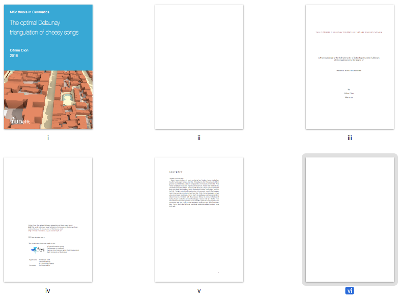

 

* Table of Content
{:toc}

- - -

<section id="p2">
</section>
## P2 template

The document for P2 is a research proposal that must contain all the elements listed in the template available in the [graduation manual]({{ "/rules/" | prepend: site.baseurl }}) (Appendix 2).

*Ignore* any other template you might get from the central BK system if different, they send these emails without realising that Geomatics doesn't have the same criteria.

You are free to write your project plan with the word processor of your choice (including LaTeX), as long as all the asked parts are present, in the same order.
You can use that [simple LaTeX template](https://gist.github.com/hugoledoux/d16d5a4d397858ac745e38f9e8561657) as starting point.

We expect a project plan to be around 10-15 pages (maximum).
It should show that you clearly know the problem you plan to solve, and that you master the related work.
We expect you to present the methodology you will use to solve your scientific problem(s), and to present preliminary results.
Also, this is a scientific proposal, so references are mandatory (even if there is no specific section in the template).

As an example, here's a [good project plan from a previous year]({{ "/pdfs/example_gradplan_mulder.pdf" | prepend: site.baseurl }}).
It contains:

  - an introduction in which the relevance of the project and its place in the context of geomatics is described, along with a clearly-defined problem statement;
  - a related work section in which the relevant literature is presented and linked to the project;
  - the research questions are clearly defined, along with the scope (ie what you will *not* be doing); to help you define a "good" research question, read [this document]( {{ '/templates/Research-Questions_WS-handout.pdf' | relative_url }})
  - overview of the methodology to be used;
  - time planning---having a [Gantt chart](https://en.wikipedia.org/wiki/Gantt_chart) is probably a better idea than just a list;
  - since specific data and tools have to be used, it's good to present these concretely, so that the mentors know that you have a grasp of all aspects of the project;
  - the references.

<!-- For the system, you need to write a *short version* (1-2 sentences per point) so that these details can be uploaded and be accessible by the chair person of your P2/P4/P5. -->
<!-- Do not upload the full project plan, this one is only for your mentors. -->

<section id="p4p5">
</section>
## P4/P5 template

Officially, there is no template.
However, we have made a [LaTeX template](https://github.com/tudelft3d/msc_geomatics_thesis_template) containing all the parts that are required (eg title page, copyright, abstract, acknowledgements, table of contents, list of figures, appendices, etc.) and is structured in such a way that most/all supervisors expect.
It looks like this:

Download the [full LaTeX source in one ZIP](https://github.com/tudelftgeomatics/thesis_template/archive/master.zip).

*It is not an official template and it is not mandatory to use it.*

Notice that the TU Delft has a [generic LaTeX template for report](https://www.tudelft.nl/en/tu-delft-corporate-design/downloads/), that can also be used, but don't forget to add the parts necessary (table of content, table of figures, appendices, etc.).

You are of course allowed to use Word (or others), if you want.
But we do not offer a template, although the TU Delft (kinda) does: [download here](https://d1rkab7tlqy5f1.cloudfront.net/Websections/TU%20Delft%20Huisstijl/BSc-MSc_report_mei_2015.doc)

